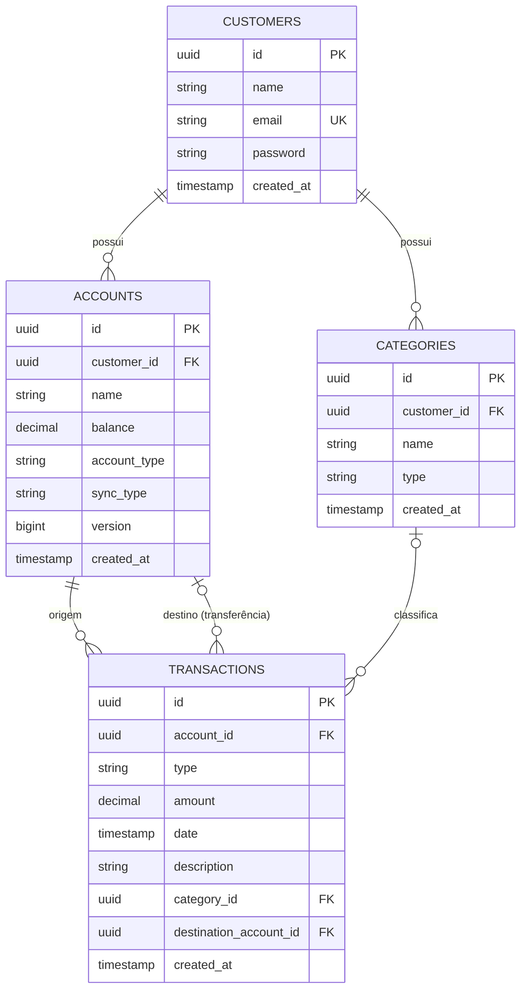

# PayMe API 💸

API REST para **controle financeiro pessoal**: cadastre suas contas, organize seus gastos por categoria e registre receitas, despesas e transferências com o saldo sempre atualizado.


---

## 📌 Sumário

- [Funcionalidades](#-funcionalidades)
- [Tecnologias](#-tecnologias)
- [Arquitetura](#-arquitetura)
- [Modelo de dados](#-modelo-de-dados)
- [Regras de negócio](#-regras-de-negócio)
- [Segurança](#-segurança)
- [Como executar](#-como-executar)
- [Documentação da API](#-documentação-da-api)
- [Endpoints](#-endpoints)
- [Testes](#-testes)
- [Próximos passos](#-próximos-passos)
- [Autor](#-autor)

---

## ✨ Funcionalidades

- Cadastro e autenticação de usuários com **JWT**
- Gestão de **contas** (corrente, poupança, investimento, carteira física)
- Gestão de **categorias** de receita e despesa, por usuário
- Registro de **transações**: receitas, despesas e transferências entre contas
- Atualização automática do **saldo** das contas a cada transação
- Isolamento de dados: cada usuário só enxerga e altera o que é seu
- Documentação interativa com **Swagger UI**

---

## 🛠 Tecnologias

| Camada | Tecnologia |
|---|---|
| Linguagem | Java 21 |
| Framework | Spring Boot 3.3.4 (Web, Data JPA, Validation, Security) |
| Banco de dados | PostgreSQL 16 |
| Migrations | Flyway |
| Autenticação | JWT (`java-jwt`) + hash de senha com Argon2 |
| Documentação | springdoc-openapi (Swagger UI) |
| Testes | JUnit 5, Mockito, Spring MockMvc, Testcontainers |
| Infra | Docker e Docker Compose |
| Build | Maven (wrapper incluso) |

---

## 🧱 Arquitetura

O projeto é organizado **por funcionalidade** (*package by feature*), e cada módulo segue a mesma divisão em camadas:

```
src/main/java/br/com/vitortheof/payme
├── account/          # contas
├── category/         # categorias
├── transaction/      # transações
├── user/             # cadastro e autenticação
│   └── (cada módulo)
│       ├── api/             # controllers REST
│       ├── application/     # services, DTOs, mappers, exceções, eventos
│       ├── domain/          # entidades e enums
│       └── infrastructure/  # repositórios (Spring Data JPA)
└── shared/           # configs, segurança, tratamento global de erros, eventos
```

Pontos de design:

- **DTOs como `record`** na entrada e na saída, sem expor entidades.
- **Tratamento global de erros** (`@RestControllerAdvice`) com respostas JSON padronizadas.
- **Eventos de domínio** (`AccountBalanceChangedEvent`) para propagar mudanças de saldo entre os módulos de transação e conta.
- **Controle de concorrência otimista** na conta (`@Version`).
- **Schema versionado** com Flyway; o Hibernate roda apenas em modo `validate`.

---

## 🗄 Modelo de dados



Restrições no banco: saldo da conta `>= 0`, valor da transação `> 0`, categoria única por `(usuário, nome, tipo)` e índices nas colunas de busca mais usadas.

**Enums**

| Enum | Valores |
|---|---|
| `AccountType` | `CORRENTE`, `POUPANCA`, `INVESTIMENTO`, `CARTEIRA_FISICA` |
| `SyncType` | `MANUAL`, `OPEN_FINANCE` |
| `TransactionType` | `RECEITA`, `DESPESA`, `TRANSFERENCIA` |

---

## 📐 Regras de negócio

- O valor de uma transação deve ser **maior que zero**.
- **Despesas e transferências** exigem saldo suficiente na conta de origem.
- **Transferências** exigem conta de destino, diferente da origem, e ambas devem pertencer ao usuário logado.
- A conta e a categoria informadas em uma transação devem **pertencer ao usuário autenticado**; caso contrário a API responde `404`.
- **Receita** soma ao saldo, **despesa** subtrai e **transferência** debita a origem e credita o destino.
- O e-mail do usuário é único.

---

## 🔐 Segurança

- **Autenticação stateless** via JWT no header `Authorization: Bearer <token>` (validade de 2 horas).
- Senhas armazenadas com **Argon2**.
- **Rate limit** no login: até 10 tentativas por minuto por IP (`429 Too Many Requests`).
- Apenas `POST /customer/register`, `POST /auth/login` e a documentação Swagger são públicos; todo o restante exige token.
- Segredos e credenciais lidos de **variáveis de ambiente** (`.env` fora do versionamento).

---

## 🚀 Como executar

### Pré-requisitos

- [Docker](https://www.docker.com/) e Docker Compose
- (Opcional, para rodar sem Docker) JDK 21

### 1. Clone o repositório

```bash
git clone https://github.com/vtzada/<nome-do-repositorio>.git
cd <nome-do-repositorio>/payme
```

### 2. Configure as variáveis de ambiente

```bash
cp .env.example .env
```

Edite o `.env`:

| Variável | Descrição |
|---|---|
| `DB_NAME` | Nome do banco PostgreSQL |
| `DB_USER` | Usuário do banco |
| `DB_PASSWORD` | Senha do banco |
| `API_SECURITY_TOKEN_SECRET` | Segredo usado para assinar os JWTs (use um valor aleatório e longo, mínimo 32 caracteres) |

### 3. Suba a aplicação

```bash
docker compose up --build
```

A API sobe em **http://localhost:8080** e o PostgreSQL em `localhost:5432`. As migrations do Flyway rodam automaticamente na inicialização.

### Rodando localmente (sem containerizar a API)

Suba só o banco e rode a aplicação pelo Maven, apontando para ele:

```bash
docker compose up -d payme-db

export SPRING_DATASOURCE_URL=jdbc:postgresql://localhost:5432/payme_db
export SPRING_DATASOURCE_USERNAME=payme_user
export SPRING_DATASOURCE_PASSWORD=<sua-senha>
export API_SECURITY_TOKEN_SECRET=<seu-segredo>

./mvnw spring-boot:run
```

---

## 📖 Documentação da API

Com a aplicação no ar, acesse o Swagger UI:

👉 **http://localhost:8080/swagger-ui.html**

Para testar rotas protegidas: faça login em `/auth/login`, copie o `token` retornado e clique em **Authorize** informando o JWT.

---

## 🔌 Endpoints

| Método | Rota | Descrição | Auth |
|---|---|---|---|
| `POST` | `/customer/register` | Cadastra um novo usuário | ❌ |
| `POST` | `/auth/login` | Autentica e retorna o JWT | ❌ |
| `POST` | `/accounts` | Cria uma conta | ✅ |
| `GET` | `/accounts` | Lista as contas do usuário | ✅ |
| `POST` | `/categories` | Cria uma categoria | ✅ |
| `GET` | `/categories` | Lista as categorias do usuário | ✅ |
| `POST` | `/transactions` | Registra uma transação | ✅ |
| `GET` | `/transactions/account/{accountId}` | Lista as transações de uma conta | ✅ |

### Exemplos

**Cadastro**

```http
POST /customer/register
Content-Type: application/json

{
  "name": "Maria Silva",
  "email": "maria@email.com",
  "password": "senha1234"
}
```

**Login**

```http
POST /auth/login
Content-Type: application/json

{
  "email": "maria@email.com",
  "password": "senha1234"
}
```

```json
{ "token": "eyJhbGciOiJIUzI1NiIs..." }
```

**Criar conta**

```http
POST /accounts
Authorization: Bearer <token>
Content-Type: application/json

{
  "name": "Nubank",
  "initialBalance": 1500.00,
  "accountType": "CORRENTE",
  "syncType": "MANUAL"
}
```

**Criar categoria**

```http
POST /categories
Authorization: Bearer <token>
Content-Type: application/json

{
  "name": "Alimentação",
  "type": "DESPESA"
}
```

**Registrar transação**

```http
POST /transactions
Authorization: Bearer <token>
Content-Type: application/json

{
  "accountId": "b3f1c0de-0000-0000-0000-000000000000",
  "type": "DESPESA",
  "amount": 89.90,
  "date": "2026-09-28T12:30:00",
  "description": "Almoço",
  "categoryId": "a1b2c3d4-0000-0000-0000-000000000000"
}
```

Para `TRANSFERENCIA`, informe também `destinationAccountId`.

### Códigos de resposta

| Código | Quando acontece |
|---|---|
| `200` / `201` | Sucesso |
| `400` | Erro de validação ou regra de negócio (ex.: saldo insuficiente) |
| `401` | Token ausente ou inválido |
| `404` | Recurso não encontrado ou de outro usuário |
| `409` | Conflito (ex.: violação de integridade ou atualização concorrente de saldo) |
| `429` | Muitas tentativas de login |

---

## 🧪 Testes

O projeto possui testes unitários (Mockito) e de integração (MockMvc + **Testcontainers** com PostgreSQL real), cobrindo cadastro, contas, categorias, transações e o rate limit do login.

```bash
./mvnw test
```

> Os testes de integração precisam do **Docker** em execução, pois sobem um container PostgreSQL temporário.

---

## 🗺 Próximos passos

- [ ] Paginação e filtro por período na listagem de transações
- [ ] Relatórios: resumo por categoria e por mês
- [ ] Edição e cancelamento de transações
- [ ] Orçamento mensal por categoria
- [ ] Transações recorrentes
- [ ] Pipeline de CI (GitHub Actions)

---

## 👨‍💻 Autor

**Vitor Theodoro da Fonseca**

[](https://github.com/vtzada)
